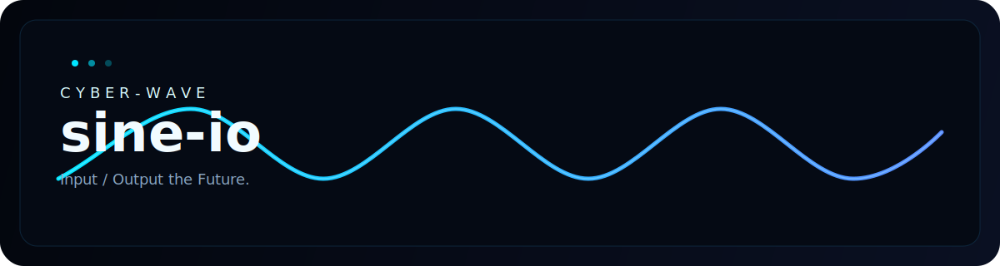
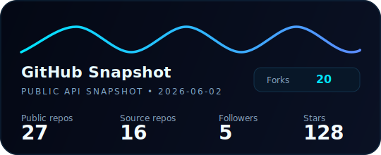
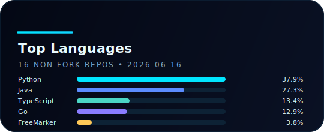

  

  

  <code>cyber-wave // dark mode // automation // performance</code>

---

<!-- byte-of-series:start -->
## 🚀 The Byte-of Series

| Series | Focus | Links |
| --- | --- | --- |
| 🧠 **Byte of AI** | 深度学习、Pytorch、大模型等课程（课程主要来自B站）笔记、总结、我的思考 | [Repo](https://github.com/sine-io/byte-of-AI) |
| ☁️ **Byte of Cosbench** | COSBench教程，深入浅出 | [Repo](https://github.com/sine-io/byte-of-cosbench) · [Site](https://www.sineio.top/byte-of-cosbench) |
| 📊 **Byte of CPA** | CPA tutorial | [Repo](https://github.com/sine-io/byte-of-cpa) |
| 🤖 **Byte of Nanobot** | 一份面向零基础用户的 nanobot 教程，带你从"能跑"到"懂原理"。 | [Repo](https://github.com/sine-io/byte-of-nanobot) · [Site](https://www.sineio.top/byte-of-nanobot) |
| 💾 **Byte of Vdbench** | Vdbench教程，深入浅出 | [Repo](https://github.com/sine-io/byte-of-vdbench) · [Site](https://www.sineio.top/byte-of-vdbench) |
<!-- byte-of-series:end -->

---

## Tech Stack

  
  
  
  

---

  
  

